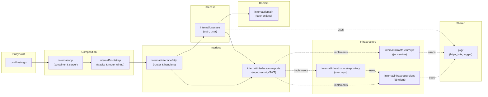

# Go Ent Clean/Hex Boilerplate

Minimal Go service using chi for HTTP, ent for data access, and a hexagonal/Clean split (domain ↔ use case ↔ ports, with infra adapters at the edge).

## Overview
- `cmd/`: entrypoints (`main.go` wires config, builds container, starts HTTP).
- `internal/app/`: composition root (builds infra, DI wiring, server lifecycle).
- `internal/domain/`: enterprise models + validation (`user`).
- `internal/usecase/`: application services (`auth` login, `user` create), DTOs and claim types.
- `internal/interface/core/ports/`: inbound/outbound interfaces (repository, security/JWT).
- `internal/interface/http/`: web adapters (router, handlers for auth/users).
- `internal/infrastructure/`: outbound adapters (ent client, user repository, JWT service wrapper).
- `pkg/`: shared helpers (e.g., `jwtx`, `httpx`, logging).
- `ent/`: ent schemas and generated code.

Dependency flow: handlers → use cases → ports → domain; infra implements ports and is injected from `internal/app`.



## HTTP Surface
- `GET /health`
- `POST /api/v1/users/register` — create user (JSON: `email`, `password`)
- `POST /api/v1/auth/login` — validate credentials, returns `{ token, user }`

## Configuration
Environment variables (via Viper; `.` becomes `_`):
- `APP_PORT` (int)
- `DB_HOST`, `DB_PORT`, `DB_NAME`, `DB_USER`, `DB_PASSWORD`, `DB_AUTO_MIGRATE`
- `JWT_SECRET` (string), `JWT_DURATION_MINUTES` (int)

Sample `.env` is included; set a real `JWT_SECRET` in non-dev environments.

## Run
```bash
go run ./cmd
```
Server listens on `:${APP_PORT}` (default 0 if unset).

## Development Notes
- Ent: edit schemas under `ent/schema`, run `go generate ./ent` to regenerate code.
- JWT: `internal/infrastructure/jwt.Service` wraps `pkg/jwtx` and is injected via the JWT port.
- Tests are not yet added; consider per-layer tests (usecase with mocks, infra with DB, handler/route with httptest).
